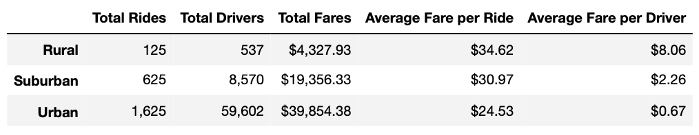

# PyBer Analysis

## Overview

### PyBer Dataset
PyBer is a python based ride-share app company. Two datasets were used: *city_data.csv* and *ride_data.csv.* *city_data.csv* contains data on the number of drivers per city and the city type for each city. *ride_data.csv* contains data on ride date, ride fare, and ride ID for each city. These datasets were cleaned, merged, analyzed, and visualized using Python version 3.7 in Jupyter Notebook. 

### Analysis Goals
The overall goal of this analysis is to help improve access to ride-sharing services and determine affordability for underserved neighborhoods. This analysis provides a summary of ride-share data by city type: urban, suburban, and rural. The first deliverable is a summary data frame and the second is a plot of ride fare over time. 

## Results

### PyBer Summary Table

Urban cities see the most rides, followed by suburban than rural cities. The number of drivers shows the same pattern, with the most drivers found in urban cities and the least in rural cities. Urban cities see the greatest total fares, followed by suburban than rural cities. The fare of a ride in rural cities is higher by almost 150% compared with urban cities. However, the average fare received by urban drivers per ride is almost 90% lower than rural drivers. 

### Change in Total Fare Over Time

During the January - April period of 2019, total rural fares remained within the $0 - $500 range. Total suburban fares began the year at ~$750, gradually increasing to reach ~$1,400 by the end of April. Total urban fares also saw an overall increase, starting at ~$1,700 in January, peaking at the end of march at ~$2,500, and ending at ~$2,250 in April. 

## Summary

### Disparities Across City Types
1. Urban cities have the greatest total ride fare, but on average their drivers are paid the least per ride. 
2. The average cost per ride is high in rural cities.
3. The total rides : total drivers ratio is relatively small in rural cities, suggesting limited access to rides. 

### Reccommendations
1. PyBer could increase the cost per ride in urban areas to better compensate its drivers. 
2. Increase the number of drivers in rural cities -this may decrease cost per ride as well as provide more access to rides in rural areas.
3. Any increases in cost per fare should occur at the start of the year when the total fare is lowest for all city types. 
