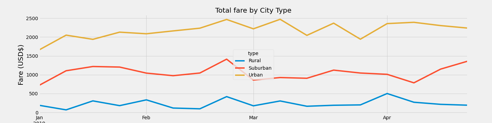

# PyBer Analysis

## Overview

### PyBer Dataset
PyBer is a python based ride share app company. Two datasets were used: *city_data.csv* and *ride_data.csv.* *city_data.csv* contains data the number of drivers per city and the city type for each city. *ride_data.csv* contains data on ride date, ride fare, and ride ID for each city. These datasets were cleaned, merged, analysed and visualised using Python version 3.7 in Jupyter Notebook. 

### Analysis Goals
The overall goal of this analysis is to help improve access to ride-sharing services and determine affordability for underserved neightborhoods. This analysis provides a summary of ride share data by city type: urban, suburban and rural. The first deliverable is a summary data frame and the second is plot of ride fare over time. 

## Results

### PyBer Summary Table

Urban cities see the most rides, followed by suburnan then rural cities. The number of drivers show the same pattern, with the most drivers found in urban cities and the least in rural cities. Urban cities see the greatest total fares, followed by suburban then rural cities. The fare of a ride in rural cities are higher by almost 150% compared with urban cities. However, the average fare recieved by urban drivers per ride is almost 90% lower than rural drivers. 

### Change in Total Fare Over Time

During the January - April period of 2019, total rural fares remained within the $0 - $500 range. Total suburban fares began the year at ~$750, gradually incerasing to reach ~$1,400 by the end of April. Total urban fares also saw an overall increas, starting at ~$1,700 in January, peaking at the end of march at ~$2,500 and ending at ~$2,250 in April. 

## Summary

need statement summarizing three business recommendations addressing disparities among the city types. 
